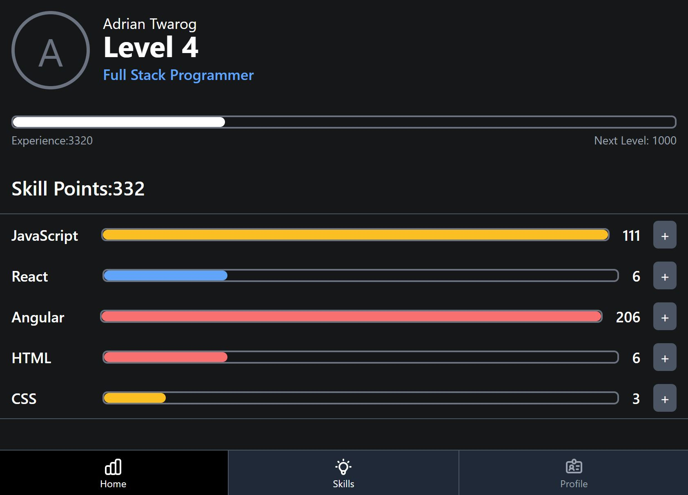

# Astra RPG

This example will is a simple RPG application that allows you to add skills and allocation skill points to them, gaining you real experience and levels as a result.



## 🎯 Objectives
* Create your own **RPG** app by cloning the project
* Learn about **Astra DB** with webapp development
* Use **React** with **state** and **props**
* Use **Netlify** to create a simple API

## 📝 Getting Started

The requirements needed are quite simple, which include an account for Astra DB (free), having Netlify CLI.

- [Astra DB](https://dtsx.io/3DpCALm)
- [Netlify](https://www.netlify.com/)


### 1. AstraDB and create database

Register a DataStax Astra account `Github`, `Google` accounts or register with an `email`.

Create a database with a keyspace of `rpg`

Once the database is created and the status is active `Active` we can move onto the next step.

### 2. Create a security token

Create a security token for with Database Permissions and use the keys to populate the `.env-template` file which should be renamed to `.env`.

### 3. Launch the RPG app

Ensure Netlify is installed, if it is not, install the CLI by running the following command:

```
npm install -g netlify-cli
```

Then you can run the application locally using

```
netlify dev
```
